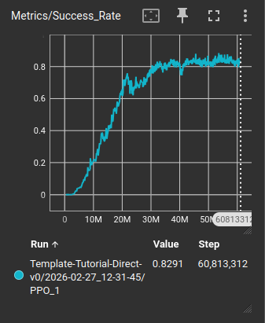
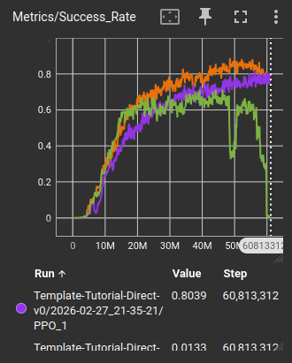
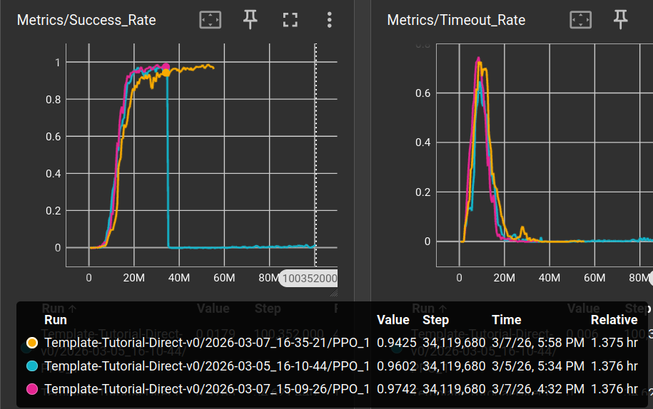
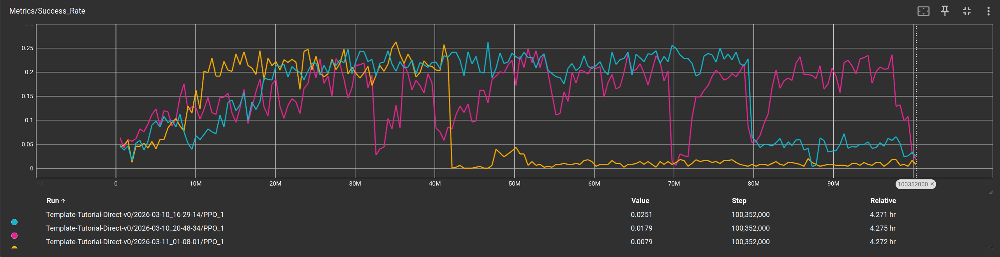

| 日志地址  | 提交id      | 描述          | 成功率统计       | 备注                 |
| -------- | ------- | ---- |:--------:| --------- |
|[seed=42](logs/sb3/Template-Tutorial-Direct-v0/2026-02-27_12-31-45)|[id](197678246b20214a93fdbe4b8977373f74949a13)|HXY训练测试，相机范围从0-255为0-1，成功率提升||
|[seed=1](logs/sb3/Template-Tutorial-Direct-v0/2026-02-27_21-35-21) [seed=2](logs/sb3/Template-Tutorial-Direct-v0/2026-02-27_23-34-36) [seed=3](logs/sb3/Template-Tutorial-Direct-v0/2026-02-28_01-33-58)|[id](ae45ecff0427c91d1f20368cde113c27249dfad5)|障碍物距离惩罚翻倍||

# 训练3
固定场景work版本,成功率超过97%，棋盘格随机场景成功率93%,Gazebo不能完全work
## 种子/模型路径：
[seed=789](logs/sb3/Template-Tutorial-Direct-v0/2026-03-05_16-10-44)
[**seed=123**](logs/sb3/Template-Tutorial-Direct-v0/2026-03-07_15-09-26)
[seed=456](logs/sb3/Template-Tutorial-Direct-v0/2026-03-07_16-35-21)
## 提交id
[id](3d181531ee5dca4f83615ad0d3b7d8f6ac9304da)
## 主要修改：
奖励函数
动作空间速度上下限
```python
obstacle_penalty = torch.clamp(4.0 * (0.8 - min_dist_to_surface), min=0.0)
    total_reward = (
        reward_velocity * 1.0  # 速度在目标方向的分量
        - penalty_smooth * 0.1  # 平滑度惩罚
        - collided * 200.0  # 碰撞惩罚
        + arrived * 300.0  # 到达奖励
        - penalty_obstacle * 2  # 障碍物距离惩罚
    action_space = spaces.Box(
        low=np.array([-0.1, -0.5, -np.pi], dtype=np.float32),  # 每个维度的最小值
        high=np.array([2.0, 0.5, np.pi], dtype=np.float32),  # 每个维度的最大值 
```
## 成功率曲线


# 训练4
网格化随机重置环境训练，不修改奖励函数情况下，效果较差，最高成功率23%
## 种子/模型路径：
[seed=123](logs/sb3/Template-Tutorial-Direct-v0/2026-03-10_16-29-14)
[seed=456](logs/sb3/Template-Tutorial-Direct-v0/2026-03-10_20-48-34)
[seed=789](logs/sb3/Template-Tutorial-Direct-v0/2026-03-11_01-08-01)
## 提交id
[id](f971a7adc542d6b708838b3ce95556a08821f823)
## 主要修改：
网格化随机障碍物位置、无人机起点终点
## 成功率曲线
