# 实验记录

| 时间               | 日志地址                                         | 描述                                                         | 提交id                                     | 成功率统计                            | 备注                                                       |
| ---------------- | -------------------------------------------- | ---------------------------------------------------------- | ---------------------------------------- |:--------------------------------:| -------------------------------------------------------- |
| 2025-01-09_10-50 | logs/skrl/quad/2026-01-09_12-07-30_ppo_torch | 修改value结构与policy相同，将vx，vy真值加入观察空间 | 1c95e4 | 梯度爆炸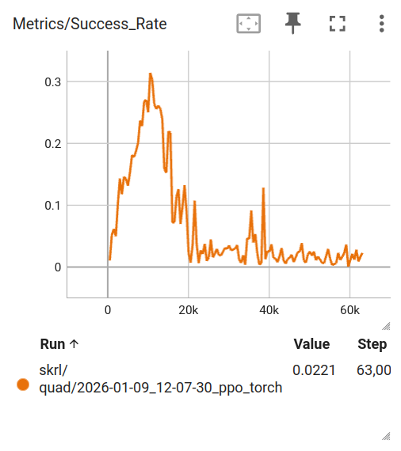     | 提交未将random_reset设为true，训练时设置为true |
| 2025-01-09_10-59 | logs/skrl/quad/2026-01-09_12-06-27_ppo_torch | 修改动作空间，将yaw角速度加入动作空间 | ca321d | 不收敛 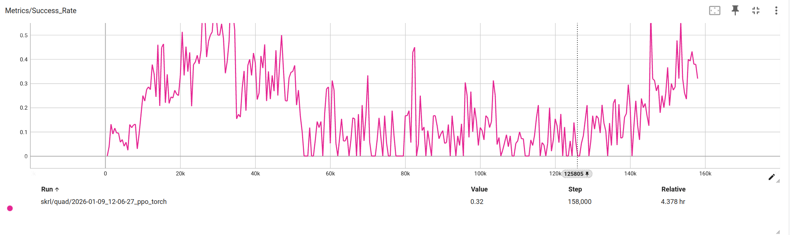       | 提交未将random_reset设为true，训练时设置为true |
| 2025-01-09_15-35 | logs/skrl/quad/2026-01-09_18-43-28_ppo_torch | 修改value结构与policy相同，将vx，vy真值加入观察空间，将到达奖励添加回来(yaw角速度不在动作空间里) | a0ac57 | 90%  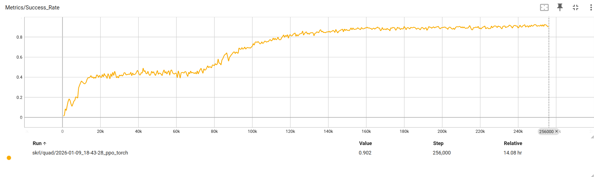    |                                                          |
| 2025-01-09_16-20 | logs/skrl/quad/2026-01-09_16-33-52_ppo_torch | 在观察空间添加相对目标的yaw角（机体坐标系） | 142b2b | 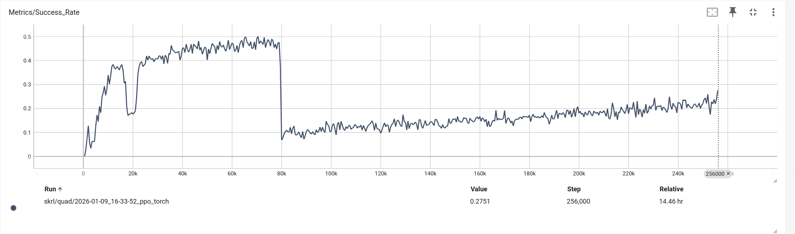         |                                                          |
| 2025-01-04_00-00 | logs/skrl/quad/2026-01-09_22-19-20_ppo_torch | 将接触传感器调整至整个无人机下的所有配件 | 930e8e | 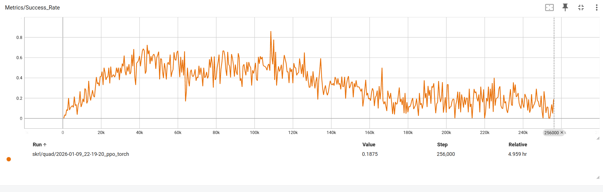         |                                                          |
| 2025-01-11_12-08 | logs/skrl/quad/2026-01-11_12-09-16_ppo_torch | 有yaw角速度，有到达奖励 | 1225ee | 40% 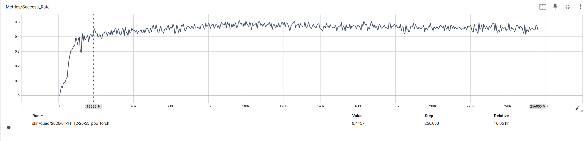     |                                                          |
| 2025-01-12_20-59 | logs/skrl/quad/2026-01-12_21-02-13_ppo_torch | 非对称actor-critic(value网络中加入最近的5个障碍物位置信息（相对位置）)(vx,vy)       | c24244 | 梯度爆炸NaN 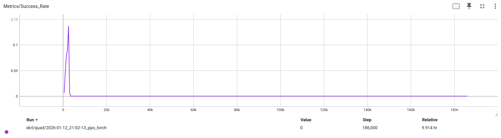 | 提交未将random_reset设为true，训练时设置为true                        |
| 2025-01-12_19-00 | logs/skrl/quad/2026-01-12_19-57-33_ppo_torch | 将碰撞检测更改为计算与障碍物的距离 | df1653 | 梯度爆炸NaN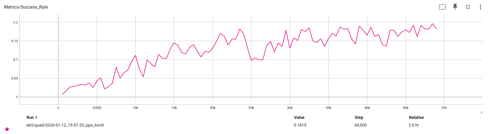  |                                    |
| 2025-01-15_11-00 | logs/skrl/quad/2026-01-15_11-39-06_ppo_torch | 删除随机重置 | 6a1ce6 | 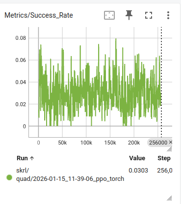 |                                    |
| 2025-01-15_20-00 | logs/skrl/quad/2026-01-15_19-52-40_ppo_torch | 更改w的范围为15度每秒 | c23979 | 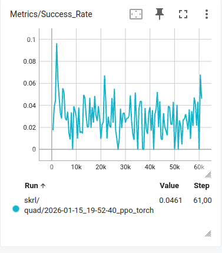 | |
| 2026-01-17_15-33 | logs/sb3/Template-Sb3-Direct-v0/2026-01-17_15-32-13 | 使用sb3框架 | 12cfa2 | play成功率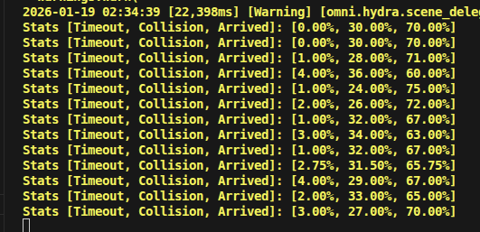 |
| 2026-01-20_15-03 | logs/skrl/quad/2026-01-20_14-59-13_ppo_torch | sb3框架和skrl框架对比实验的skrl部分| dd4721 |<10% 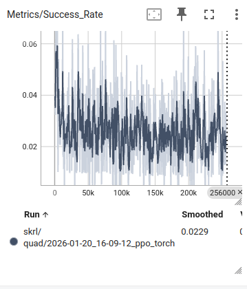| 训练位于jyyan |
| 2026-01-20_15-03 | logs/sb3/Template-Tutorial-Direct-v0/2026-01-20_14-58-29 | sb3框架和skrl框架对比实验的sb3部分| dd4721 | 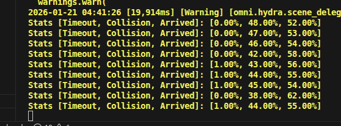| 训练位于HXY |
| 2026-01-21_13-15 | logs/skrl/quad/2026-01-21_12-34-44_ppo_torch | 在观察空间加入偏航角速度skrl | 527d6e | NaN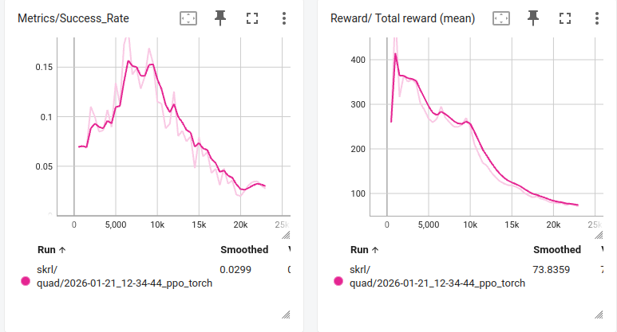|
| 2026-01-21_13-15 | logs/sb3/Template-Tutorial-Direct-v0/2026-01-21_12-34-51 | 在观察空间加入偏航角速度sb3 | 527d6e | 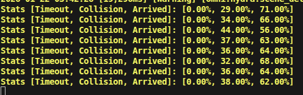 |
| 2026-01-21_19_14 | logs/skrl/quad/2026-01-21_19-13-32_ppo_torch | 上帝视角skrl，将最近的5个障碍物的信息给到actor | ed494b |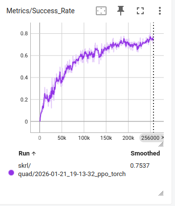 | |
| 2026-01-22_11-49 | logs/sb3/Template-Tutorial-Direct-v0/2026-01-22_11-46-34 | 上帝视角sb3，将最近的5个障碍物的信息给到actor | ed494b | | 训练位于HXY |
| 2026-01-22_15-32 | logs/skrl/quad/2026-01-22_15-38-14_ppo_torch | img_features和state_features add在一起，添加sb3的成功率统计:skrl部分 | 63b308 | 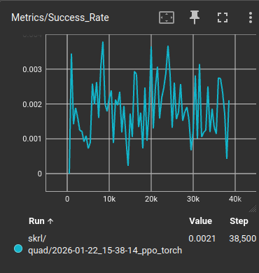 | 训练位于jyyan |
| 2026-01-22_15-32 | logs/sb3/Template-Tutorial-Direct-v0/2026-01-22_17-35-33 | img_features和state_features add在一起，添加sb3的成功率统计:sb3部分 | 91890e | 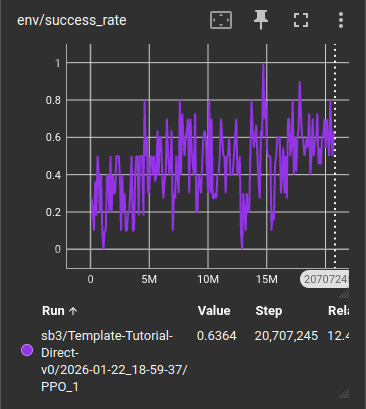 | 训练位于jyyan |
| 2026-01-26_12-00 | logs/skrl/quad/2026-01-26_12-41-39_ppo_torch | 换成hummingbird,非上帝视角 SKRL | 98b199 |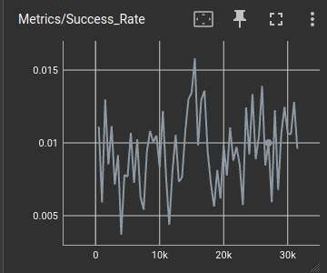 | 训练位于HXY |
| 2026-01-26_12-00 | logs/sb3/Template-Tutorial-Direct-v0/2026-01-26_12-38-41 | 换成hummingbird，非上帝视角 SB3| 98b199 |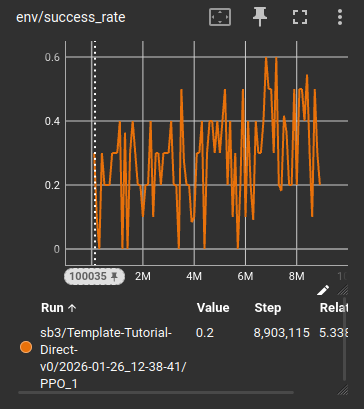 | 训练位于jyyan |
| 2026-01-26_14-00 | logs/skrl/quad/2026-01-26_14-12-58_ppo_torch | hummingbird 上帝视角 skrl | 809388 | 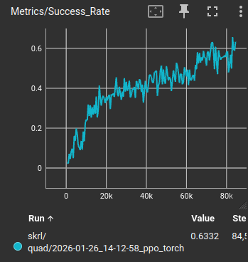 | 训练位于HXY |
| 2026-01-26_19-28 | logs/skrl/quad/2026-01-26_19-48-35_ppo_torch | 上帝视角，更改动作空间的最大最小值skrl | 227e5d | 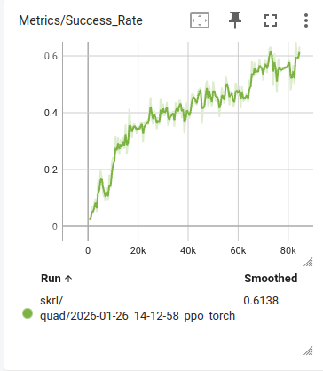| 训练位于HXY |
| 2026-01-26_19-28 | logs/sb3/Template-Tutorial-Direct-v0/2026-01-26_19-49-03 | 非上帝视角，更改动作空间的最大最小值sb3 | 227e5d | 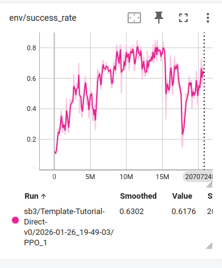| 训练位于jyyan |
| 2026-01-27_12-21 | logs/skrl/quad/2026-01-27_12-33-35_ppo_torch | 改变目标点重置方式为4条边随机采样SKRL | 88b48a | 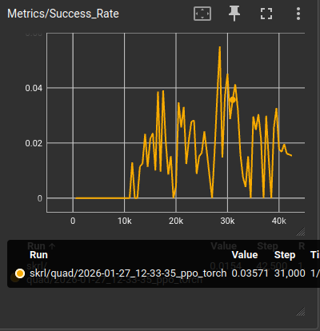| 训练位于HXY |
| 2026-01-27_12-21 | logs/sb3/Template-Tutorial-Direct-v0/2026-01-27_12-33-14 | 改变目标点重置方式为4条边随机采样SB3 | 88b48a | 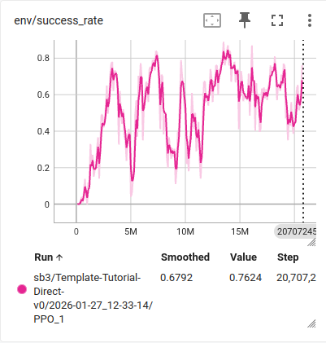| 训练位于jyyan |
| 2026-01-28_12-54 | logs/sb3/Template-Tutorial-Direct-v0/2026-01-28_12-52-15 | 加平滑度惩罚 | cc2a52 | | 训练位于jyyan |
| 2026-01-28_12-54 | logs/skrl/quad/2026-01-28_12-52-05_ppo_torch | 加平滑度惩罚 | cc2a52 | | 训练位于jyyan |
| 2026-02-02_15-00 | logs/sb3/Template-Tutorial-Direct-v0/2026-02-02_16-49-07 | 使用512的batchsize，TiledCameraCfg | 365006 | 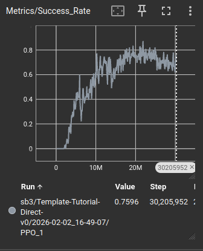 | 训练在Y9，提交中网络输出的动作被固定动作覆盖，需要删除相应代码|
| 2026-02-02_21-43 | logs/sb3/Template-Tutorial-Direct-v0/2026-02-03_00-35-00 | 调整奖励函数 | 980304 | 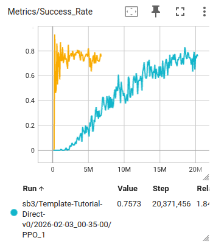| 训练在Y9 |
| 2026-02-03_14-05 | logs/sb3/Template-Tutorial-Direct-v0/2026-02-03_14-02-31 | 修改learning Rate scheduler KLAdaptiveLR,修改随机障碍物位置 | be1e61 || 训练在Y9 |
| 2026-02-03_17-00 | logs/sb3/Template-Tutorial-Direct-v0/2026-02-03_23-42-55|小改reward|132379||tensorboard日志在logs/sb3/Template-Tutorial-Direct-v0/2026-02-03_19-16-48/PPO_2|
| 2026-02-09_22-35 | logs/sb3/Template-Tutorial-Direct-v0/2026-02-10_11-38-08 | 添加障碍物相关密集惩罚 | 06dac2 | 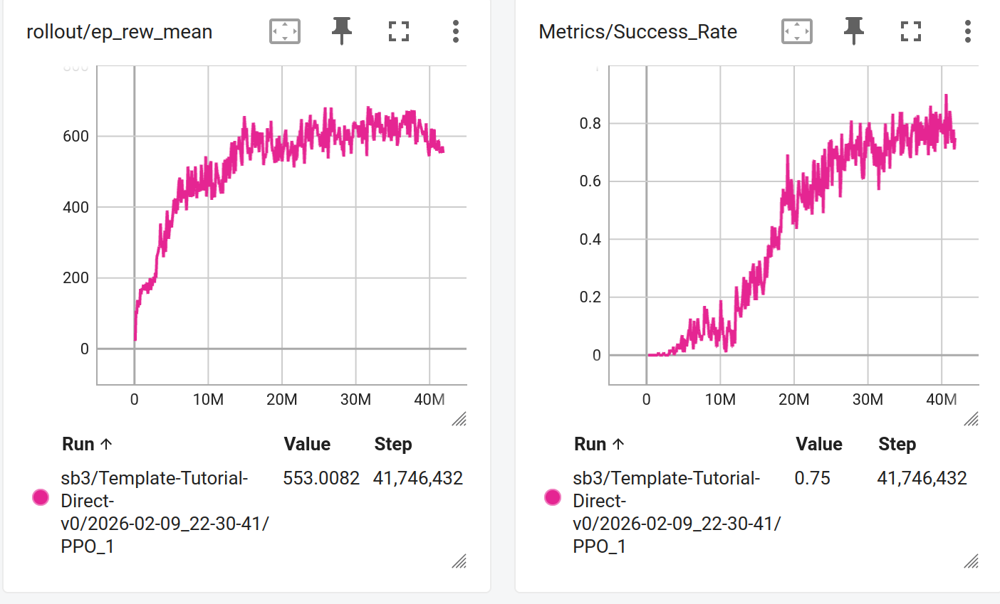 ||
| 2026-02-10_22-35 |  | 小改奖励函数,删除KL散度自适应学习率相关代码    total_reward = (
        reward_velocity * 10.0  # 速度在目标方向的分量
        + 2.0  # 存活奖励
        - penalty_smooth * 0.1  # 平滑度惩罚
        - collided * 20.0  # 碰撞惩罚
        + arrived * 300.0  # 到达奖励
        - penalty_obstacle  # 障碍物距离惩罚
    ) | 0f11df91c6a9f226e4af2a8215ca5771f7d68572 |  ||
# TO DO LIST

- [ ] 动作空间课程学习
- [ ] 非对称AC,最近5个障碍物信息替换深度图
- [x] 上帝视角最近的5个障碍物信息给到actor
- [ ] robot-state-fc 和 camera-feature-fc cat 改 add
- [x] 取消skrl的非对称，robot-state-fc 和 camera-feature-fc cat 改 add
- [x] 将动作空间限制改大
- [ ] flightbench